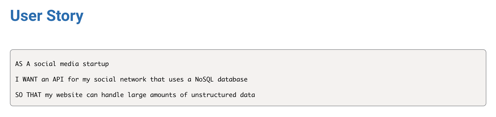
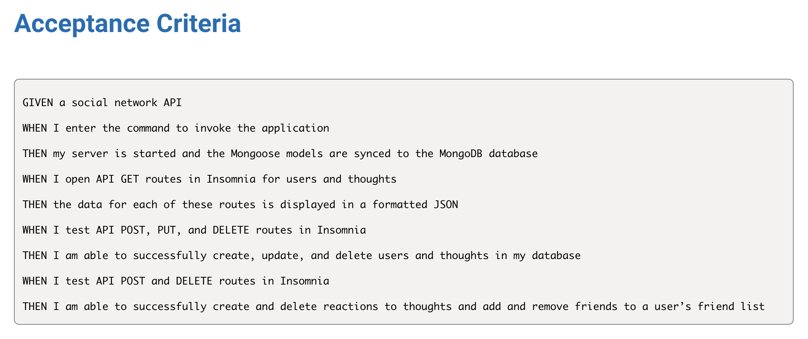

# Social Network API

  
  ## Table of Contents
  - [Project description](#description)
  - [Installation](#installation)
  - [Useage](#usage)
  - [Collaborators](#collaborators)
  - [How to Contribute](#contributing)
  - [Testing](#tests)
  - [License](#license)
  ## Description 
This is an API for a social network web application where users can share their thoughts, react to friends' thoughts, and create a friend list. It uses Express.js for routing, a MongoDB database, and the Mongoose ODM.

  
  ## Requirements
 * Node.js
 * MongoDB
 * Mongoose
 * Express
  
  ## Usage 
To start the application, run the following command: npm start

The application will be accessible at http://localhost:3001 or the configured host and port.

To interact with the API, you can use tools like Insomnia or Postman.

  ## Questions?
  Please contact me at:
  GitHub: https://github.com/elawilliam
  Email: ela.witham@gmail.com
  
  ## License 
  Social Network API is licensed under the: 
  
  